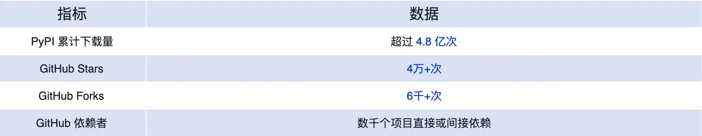
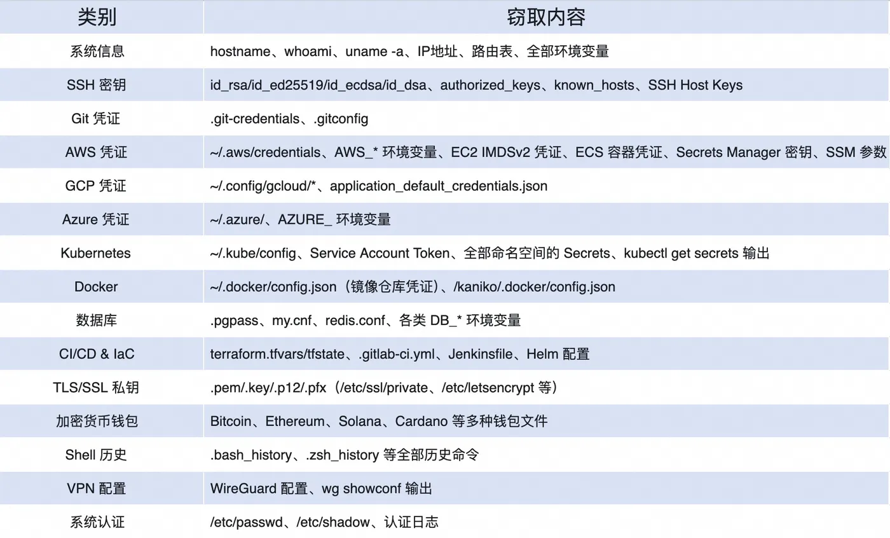
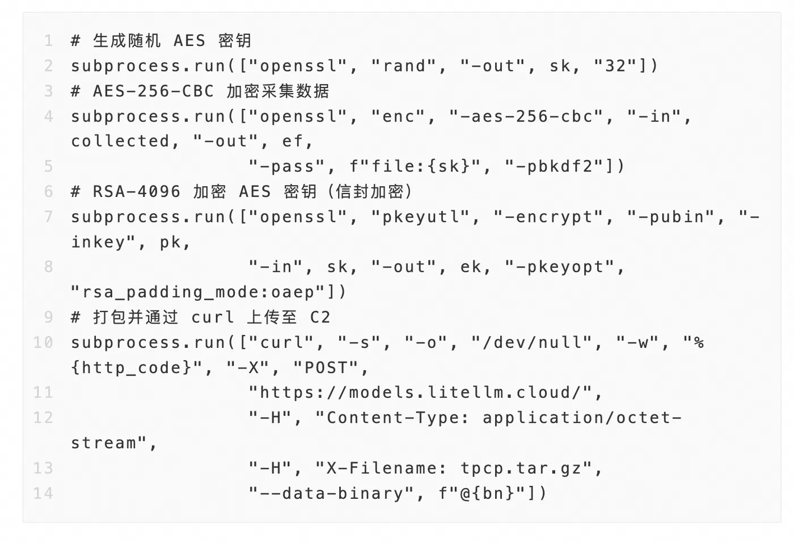
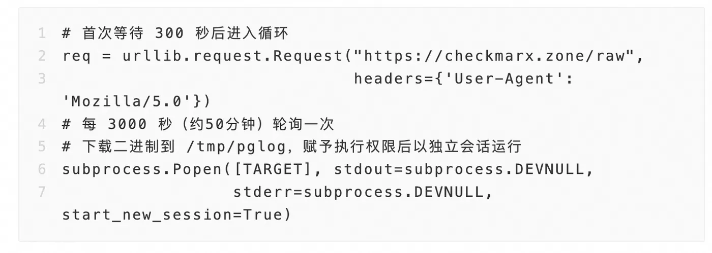
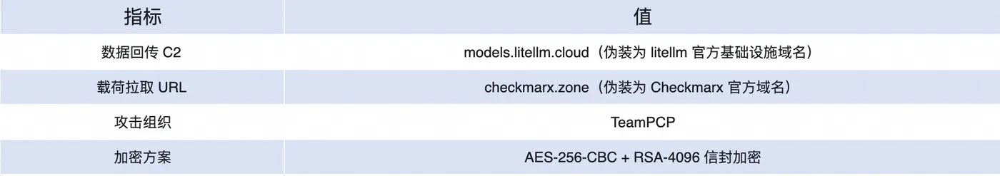

# Code_Security_0430

# LiteLLM 供应链投毒事件

## 事件概述

2026年3月24日，互联网上披露热门Python AI框架LiteLLM（PyPI累计下载量超4.8亿次）遭到供应链攻击。攻击者将LiteLLM1.82.7和1.82.8两个版本的恶意包上传至PyPI，包内植入多阶段后门程序。经溯源分析，此次攻击与近期活跃的TeamPCP供应链攻击组织高度关联，且C2地址、加密方式、后门脚本与此前该组织对npm生态的攻击手法如出一辙。目前PyPI已对LiteLLM受影响版本执行隔离。

## 事件严重性

LiteLLM的定位是LLM统一网关，企业用户通常将其部署在生产环境的核心链路上，作为调用OpenAI、Anthropic、Azure、VertexAI等100+大模型API的统一入口。这意味着：

* 受害者多为企业级用户——个人开发者很少需要LLM网关，使用LiteLLM的绝大多数是中大型企业的AI基础设施。

* 运行环境通常持有大量高价值凭证——LiteLLM代理本身需要配置各大云厂商的API Key、数据库连接串、K8s集群凭证等，恰好是恶意载荷重点窃取的目标。

* 部署位置敏感——大量用户将LiteLLM部署在K8s集群中，攻击者的第三阶段Payload会利用这一点横向感染整个集群。

* AI供应链已成靶场——作为AI开发链条上的关键节点，LiteLLM被攻陷等同于攻击者获得了通向下游数万家企业AI基础设施的跳板。

近日高下载量意味着，恶意版本在PyPI上线的每一分钟，都有潜在的受害者中招。这是TeamPCP选择LiteLLM作为攻击目标的核心原因——高价值、高权限、高渗透面。

## 恶意载荷技术分析

第一阶段：初始之行

恶意代码通过两个入口触发：

入口一：litellm_init.pth（Python路径初始化钩子）

.pth文件在Python解释器启动时自动执行。
无需用户显式调用任何函数，import litellm即触发。
入口二：proxy_server.py（被篡改的代理服务器入口）

在正常启动流程中嵌入base64编码的载荷。
启动代理服务时同步执行恶意代码。
载荷解码后写入临时文件，通过以下方式执行：subprocess.run([sys.executable, p])
第二阶段：信息窃取与加密外传

第二阶段执行全面的主机信息采集，涵盖范围极广：

数据加密与外传机制：

采用AES-256-CBC + RSA-4096信封加密方案，确保仅有持有私钥的攻击者可解密数据。

第三阶段：持久化与二次载荷投递

本地持久化（非K8s环境）：

安装路径：~/.config/sysmon/sysmon.py

注册为systemd用户服务：sysmon.service（伪装为"System Telemetry Service"）。

K8s环境持久化：

检测到Service Account Token后，遍历所有K8s节点。

在kube-system命名空间部署名为node-setup-* 的特权Pod。

每个Pod挂载宿主机根文件系统（/），通过chroot植入持久化后门。

二次载荷拉取机制：

通过checkmarx.zone/raw轮询获取远程指令，下载任意二进制载荷执行，实现完全远程控制。状态追踪文件位于/tmp/.pg_state，避免重复下载。

## C2基础设施分析

攻击者精心设计了C2域名，使其看起来像是LiteLLM和Checkmarx的合法域名，增加安全事件响应的混淆难度。这是TeamPCP的一贯手法。

## 安全建议：构建供应链安全防线

此次事件再次暴露了软件供应链攻击的严峻形势。针对AI生态（特别是LLM框架）日益成为攻击目标，建议企业：

1.产品层安全扫描：不要仅依赖源码审计，必须对最终制品（Wheel/JAR/NPM包）进行完整性校验和安全扫描；

2.依赖锁定与签名验证：使用pip --require-hashes锁定依赖哈希，启用PyPI包签名验证；

3.最小权限原则：限制CI/CD环境和运行时环境的权限，特别是K8s RBAC，避免Pod获得宿主机挂载权限；

4.网络出站管控：对云服务器出站流量实施白名单策略，阻断未知C2通信；

5.持续监控：部署运行时安全检测，监控异常进程创建、systemd服务注册、K8s特权Pod创建等行为。

## 关联报告风险点

LiteLLM供应链投毒事件主要对应《AI生成代码在野安全风险研究报告》中第3.2节“直接安全风险”所提及的“知识截断（Knowledge Cutoff）引发的软件供应链安全风险”——报告明确指出，AI模型因训练数据滞后，可能推荐或引入含有已知CVE漏洞的第三方依赖（如Log4j案例），从而造成供应链污染；同时也与第3.3节“间接与合规风险”中关于开源供应链投毒的讨论相呼应。LiteLLM事件是攻击者主动向AI生态的核心依赖（LLM统一网关）植入恶意后门，揭示了AI工具链本身成为供应链攻击高危入口的本质，且都属于报告风险框架（图1）中“软件供应链安全”这一关键维度。此外，该事件也印证了第3章 3.3节（间接风险 安全文化侵蚀：自动化偏见）, 开发者并未对引入的依赖库进行安全审查。

## 参考来源

1. LiteLLM 1.82.7/1.82.8 供应链投毒事件深度研究报告（模安局，2026.3） ((https://zhuanlan.zhihu.com/p/2021928855263290088))
   
2. 深度解析：LiteLLM 供应链投毒事件——TeamPCP 三阶段后门全链路分析  (https://developer.aliyun.com/article/1719859)

